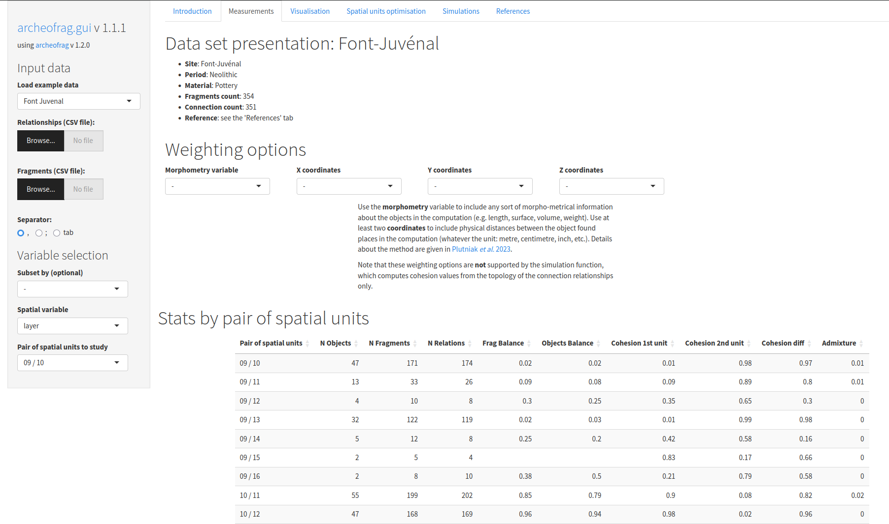

archeofrag.gui: Spatial Analysis in Archaeology from Refitting Fragments (GUI)
=====

A 'Shiny' application to access the functionalities and datasets of the 'archeofrag' package for spatial analysis in archaeology from refitting data. Quick and seamless exploration of archaeological refitting datasets, focusing on physical refits only. Features include: built-in documentation and convenient workflow, plot generation and exports, anomaly detection in the spatial distribution of refitting connection, exploration of spatial units merging solutions, simulation of archaeological site formation processes, support for parallel computing, R code generation to re-execute simulations and ensure reproducibility, code generation for the 'openMOLE' model exploration software.
A demonstration version of the app is available [online](https://analytics.huma-num.fr/Sebastien.Plutniak/archeofrag).


[](https://www.repostatus.org/#active)
[](https://lifecycle.r-lib.org/articles/stages.html#stable)
[](https://github.com/sebastien-plutniak/archeofrag.gui/actions/workflows/R-CMD-check.yml)
[](https://doi.org/10.5281/zenodo.14554894)
[](https://archive.softwareheritage.org/browse/origin/?origin_url=https://github.com/sebastien-plutniak/archeofrag.gui)
[](https://sebastien-plutniak.r-universe.dev/ui#package:archeofrag.gui)
[](https://CRAN.R-project.org/package=archeofrag.gui)
[](https://cran.r-project.org/package=archeofrag.gui)
[](https://www.r-project.org/Licenses/GPL-3)


# Summary 


The [TSAR](https://doi.org/10.1016/j.jas.2021.105501) method (Topological Study of Archaeological Refitting) is a set of methods to evaluate and validate the distinctions between archaeological spatial units (e.g. layers) from the distribution and the topology of the refitting relationships between the fragments of objects contained in these units. 
This method is implemented in the [`archeofrag`](https://github.com/sebastien-plutniak/archeofrag) R package, which is complemented by a GUI application, [`archeofrag.gui`](https://analytics.huma-num.fr/Sebastien.Plutniak/archeofrag/). 
This R Shiny application implements and extend `archeofrag` functionalities, making the exploration of refitting dataset fast and easy. 

[](https://analytics.huma-num.fr/Sebastien.Plutniak/archeofrag/)


# Contents

- [**Installation**](#installation)
- [**About archeofrag**](#about-archeofrag)
- [**archeofrag.gui features**](#archeofrag.gui-features)
- [**Data input**](#data-input)
- [**Parallelization**](#parallelization)
- [**Anomaly detection in the spatial distribution of refitting connection**](#anomaly-detection-in-the-spatial-distribution-of-refitting-connection)
- [**Spatial units merging**](#spatial-units-merging)
- [**Comparison with simulated data to test formation scenarios**](#comparison-with-simulated-data-to-test-formation-scenarios)
- [**Community guidelines**](#community-guidelines)
  - [Reporting bugs](#reporting-bugs)
  - [Suggesting changes](#suggesting-changes)
- [**References**](#references)


# Installation

The package can be installed from CRAN with:

```r
install.packages("archeofrag.gui")
```

The development version is available from *GitHub* and can be installed with:

```r
if ( ! requireNamespace("remotes", quietly = TRUE))
    install.packages("remotes")
remotes::install_github("sebastien-plutniak/archeofrag.gui")
```

The determination of graph planarity in the `archeofrag` package requires the `RBGL` package, available through *Bioconductor*:
This feature is optional, because 
1. even if archaeological fragmentation graphs are [planar](https://en.wikipedia.org/wiki/Planar_graph) in most of the cases, there are exceptions  
2. `RBGL` is a very large package.


```r
if ( ! requireNamespace("BiocManager", quietly = TRUE))
    install.packages("BiocManager")
BiocManager::install("RBGL")
```


# About archeofrag

Please refer to the `archeofrag` package documentation on [CRAN](https://github.com/sebastien-plutniak/archeofrag) or [github](https://github.com/sebastien-plutniak/archeofrag) to learn about its methods and functions for spatial and refitting analysis.


# archeofrag.gui features

* Exclusive focus on connection relationships (i.e. physical refits)
* Integrated workflow for quick and efficient use of `archeofrag` functionalities
* Convenient access to refitting datasets included in `archeofrag`
* Built-in documentation
* Charts generation and SVG export
* R code generation
* [*openMOLE*](https://openmole.org) code generation, a model exploration software
* Interoperability: data can be exported to `archeofrag.gui` from the [*archeoViz*](https://analytics.huma-num.fr/archeoviz/en) application for archaeological spatial data visualisation.


# Data input

Either load one of the built-in example data sets or upload your data. Use the menu on the left to upload your 'connection' and 'fragments' data as CSV files.

* The relationships table must have a row for each refitting relationship, and two columns containing the identifiers of the two fragments.
* The fragments table must have a row for each fragment, the first column is for fragments identifier and the second column contains the spatial unit they are associated to.


# Parallelization

Parallelization in `archeofrag.gui` relies on the `foreach` and `doParallel`  packages.
By default, half of the available cores are registered when the app is launched but this number can be controlled with the `n.cores` parameter:

```r
archeofrag.gui(n.cores=15)
```

# Anomaly detection in the spatial distribution of refitting connection

Let us assume that:

* a spatial unit is expected to be more similar to those near it (i.e. less dissimilar). E.g., In the case of stratigraphic layers, a layer is expected to have more refitting connection with the layers located directly above and below it,
* the alphanumerical labels of the spatial units reflect their relative location (e.g. the labels follow the stratigraphic order).

`archeofrag.gui` 'Measurement' tab offers a workflow where:
* the `archeofrag` 'admixture' is used as a dissimilarity measure and hierarchical clustering methods are applied.
* The dendrogram's branches are constrained to be ordered alphanumerically, revealing anomalies when, despite this ordering constraint, the expected order of superposition is not observed in the results.
* Using a tanglegram makes it possible to compare the resulting 'observed' dendrogram and an 'expected' dendrogram representing the spatial ordering assuming no perturbation and an equal number of refits for all spatial units.
* Computing the *entanglement* value of the tanglegram and the *cophrenetic correlation* value of the 'observed' dendrogram help evaluating the results of the different clustering methods.

# Spatial units merging

Archaeological spatial units are likely to be recombined, for example when there are reasons to merge stratigraphic layers. The 'Spatial units optimisation' tab helps in this task with two functions: the first for fast statistical exploration of the effects of the different merging solutions, the second to merge selected spatial units in the data under study. 

## Statistical exploration of merging options

The first function list the possible merging of pairs of spatial units and returns, for each option, summarises the differences between the cohesion values of all the resulting pairs of spatial units: the lower this difference, the more balanced the archaeological information about them (regardless of their possible admixture). 
Given a series of spatial units, this function: 
1. determines the list of possible combinations of pair of spatial units
2. computes the cohesion values  and its difference for each combination and summarises it by calculating the median value of these differences
3. return and sort the solutions.

Merging solutions with lower median values reflect spatial divisions for which the archaeological information is best balanced.

## Merging spatial units

The second function makes it possible to select and merge spatial units. The resulting series of units is then available from all *archeofrag.gui* functions.


# Comparison with simulated data to test formation scenarios

Hypotheses about two aspects of site formation processes are of particular interest and can be studied by generating series of fragmentation graphs to compare: 

1. the number of deposition events and 
2. the direction of fragments transport between the first and second spatial units considered. 

Select the pair of spatial units to compare in the left menu, set the number of simulated data sets to generate, and click on the “Run” button. Depending on the size of the data set, the computing time can be long. Charts are generated for various parameters measured on the fragmentation graphs: the value observed on the empirical graph is represented by a vertical bar, the distribution of values for each hypotheses are represented by dark (H1) and light (H2) grey shades.

## 1. Number of deposition events

Fragmentation graphs can be generated for two hypotheses regarding the number of deposition events involved in the formation of the considered pair of spatial units:

* H1. The objects were buried during one deposition event forming a single spatial unit, were subsequently fragmented and moved, and were discovered in two spatial units according to the archaeologists;
* H2. The objects were buried during two deposition events forming two spatial units, were subsequently fragmented and moved, and were discovered in two spatial units according to the archaeologists.


## 2. Direction of fragments transport

The 'Unidirectional transport from unit...' parameter makes it possible to constrain the direction of fragments transport between the two spatial units under study.

The observed data can be compared to similar simulated data for two formation hypothesis:


# Community guidelines

## Reporting bugs

If you find a bug, please fill an [issue](https://github.com/sebastien-plutniak/archeofrag/issues) with all the details needed to reproduce it.

## Suggesting changes

Suggestions of changes to `archeofrag.gui` are very welcome. These requests may concern additional functions, changes to documentation, additional examples, new features, etc. 
They can be made by filling an [issue](https://github.com/sebastien-plutniak/archeofrag/issues) and, even better, using pull requests and the [GitHub Fork and Pull
model](https://help.github.com/articles/about-pull-requests).


# References

Please use **Plutniak 2022a** to cite `archeofrag.gui`.


For more details, see the following publications:

* **Plutniak, S. 2021**. “[The Strength of Parthood Ties. Modelling Spatial Units and Fragmented Objects with the TSAR Method – Topological Study of Archaeological Refitting](https://hal.archives-ouvertes.fr/hal-03419952)”, *Journal of Archaeological Science*, 136, p. 105501. DOI: [10.1016/j.jas.2021.105501](https://doi.org/10.1016/j.jas.2021.105501).
* **Plutniak, S. 2022a**. “Archeofrag: an R package for Refitting and Spatial Analysis in Archaeology”, *Journal of Open Source Software*, 7 (75), p. 4335. DOI: [10.21105/joss.04335](https://doi.org/10.21105/joss.04335).
* **Plutniak, S. 2022b**. “[Archeofrag: un package R pour les remontages et l'analyse spatiale en archéologie](https://rzine.gitpages.huma-num.fr/site/ressources/20220811_archeofrag_joss/)”, *Rzine*.
* **Plutniak, S. 2022c**. “[L'analyse topologique des remontages archéologiques : la méthode TSAR et le package R archeofrag](http://www.prehistoire.org/offres/doc_inline_src/515/0-BSPF_2022_1_2e_partie_Correspondance_PLUTNIAK.pdf)”, *Bulletin de la Société préhistorique française*, 119 (1), p. 110-113.
* **Plutniak, S., J. Caro, C. Manen 2023**. “Four Problems for Archaeological Fragmentation Studies. Discussion and Application to the Taï Cave’s Neolithic Pottery Material (France)”, in A. Sörman et al., *Broken Bodies, Places and Objects. New Perspectives on Fragmentation in Archaeology*, London: Routledge, DOI: [10.4324/9781003350026-10](https://doi.org/10.4324/9781003350026-10).
* **Plutniak, S. 2025**. “[Évaluer les unités spatiales et analyser la formation des ensembles archéologiques à partir des remontages : l’application archeofrag.gui, une chaîne opératoire intégrée](https://hal.archives-ouvertes.fr/hal-05352218)”, *Bulletin de la Société préhistorique française*, 122 (3), p. 489-493.
